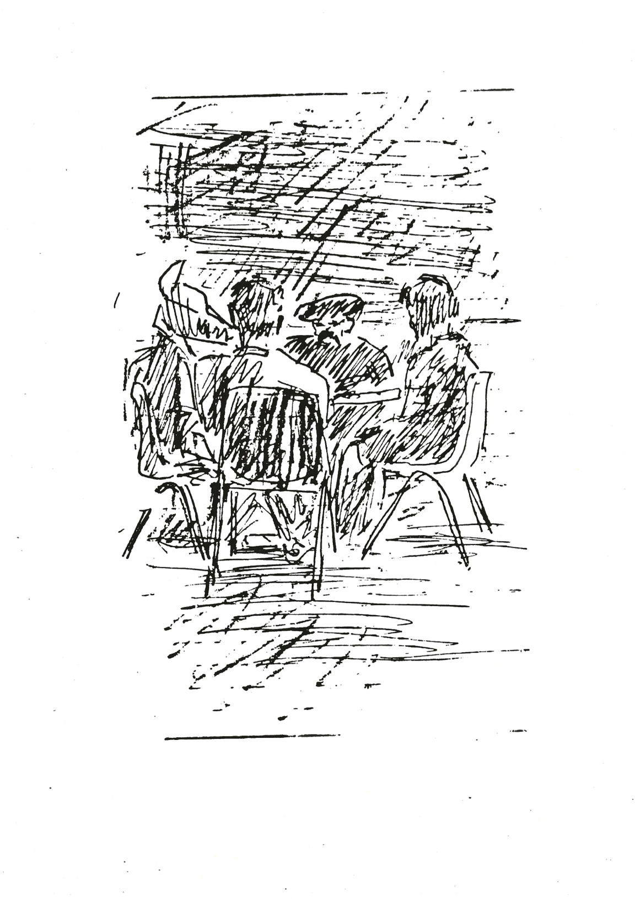

\(Janet Scott is a professional writer on Contemporary Art. She is based
in London.\)

'Janet?'

My brother on the phone. The artist and film-maker Michael Scott.

'Yes\...?'

\'I want you to do a little filming for me, with your tape- recorder.\'
Used to his ways, I understood. He wanted an interview. \'I\'ve met
these two characters in Holland Park. Conceptual artists, so to speak. I
think you should meet them.\'

Michael had proved himself in the past a sensitive judge of the unusual,
so I fished for details. He refused to elaborate. I was to meet him the
following day at the cafe in Holland Park, three o\'clock. I agreed.

Quite by accident we arrived on the same tube. Walking up from the
station I asked him to explain at least something of who these artists
were.

Tape-recorder?

Is it on\...? It started in the Spring. I was happy the leaves were out.
You know how I am. I love the feel of it. Anyway I\'m coming down from
the Gate with the groceries. My usual route, up here through the park. I
see these two men. A young one on the wrong side of the fence. Just up
there, I\'ll show you. The old man handing over a carrier bag full with
something. I pretended to take no notice but the old man was sharp, gave
me a look like a magnet. Then looked away.

\'Saw them frequently after that. More Kensington eccentrics I thought.
Not quite, curiosity persisted. I discovered what was in the carrier
bag. Saw them down by the drinking fountain picking soft drink cans out
of the waste-bin. Seemed the old man suspected I knew what they were
doing. Gave me that look, the magnet.

\'It was here. Here by the dead tree, that\'s where I first saw them. I
reckoned they\'d stashed the bag in the rhododendrons, and I was right.
Spent an afternoon reading round the corner. Caught them at it a number
of times.

\'Metal and wood. Mean anything to you? Thought not. It did to me. I
developed a hunch.\'

Michael started on his someone-developing-a-hunch imitation. Shoulders
up. Head lowered. Half-closed his eyes and pursed his lips. We were
passing the peacocks. Almost at the cafe.

I was getting impatient by degrees.

\'Next time I saw them I resolved to try it out, my hunch. They were
playing chess overlooking the flowerbeds. I got a cappuccino, returned
and sat on an adjacent bench. Beautiful early Summer\'s day just like
today. The flowers were radiant. I waited for the look. There it was!
Ready\... Before he had a chance to turn his head I blurted out:
\'Loveworkandknowledge!\'

\'\...it worked.\' He looked at me very seriously. Very silently, and
demanded: \'What you know about that!!\'

Michael could be obscure at the best of times, this was the worst. I was
preparing to strangle him.

\'Puzzled..? It's a quote from Wilhelm Reich: \"Love, work, and
knowledge are the wellsprings of our life. They should also govern it.\"
They were building an orgone accumulator inside the dead tree. The one I
showed you, at the top of the park. It's hollow, they have it all
covered inside with flattened cans. Don\'t tell me! You\'ve never heard
of an orgone accumulator.\'

What was he talking about\...? We\'d reached the cafe. They were there
at one of the tables under the trees, waiting. The young one, bright red
anorak, black trousers, flame coloured running shoes. The old man: black
beret, large droopy moustache, denim shirt, dark double-breasted jacket,
fawn trousers. In his hand an old man\'s walking stick. The face of the
young man: angular, dog-like. The old one likewise, but deeply lined.
Given a hard morbid expression by the moustache. I wondered what I was
letting myself in for.

The young man jumped up and greeted Michael in a strident emphatic
Ulster accent. Introductions were made. The young man name of Genius
O'Wolfie. The old man: Don Miguel Baptista Diabrete. Genius disappeared
for our coffee. Michael rehearsed with Mr. Diabrete the form the
interview was to take. I was to be myself I was relieved to hear. As a
journalist I would attempt to draw out and grasp the concept Michael
wished to \"film\" Diabrete and 0\'Wolfie presenting to the world. \'To
the world\...\' My heart sank when I heard that.

There was a discernable gruffness on the part of the old man. His voice
low, sardonically drawled. The accent: was it really American..? He
surveyed the whole affair, me especially, from a firm base of
scepticism. Michael was the instigator here. I might have known.

I was starting to feel distinctly uncomfortable by the time young Genius
resumed his seat. I was unprepared. Yet I could see it would be
fruitless to protest that professionally I could not approve. I was to
improvise. Michael grinned at me impishly. Fine for him, I thought,
he\'s in his element. \'Tape-recorder!\' he directed. Placing it between
the four of us I turned it on\...

MS: First question\...?

JS: \...Tell me Mr. Diabrete..

GO\'W: Don Miguel.

JS: Tell me Don Miguel, what is this concept I\'m intended to grasp?

MBD: CREATIVE+UNION.

GO'W: CREATIVE+UNION is clearly defined by its antithesis namely
DESTRUCTIVE-ALIENATION. There\'s enough of that around to have a fairly
good idea of what he\'s talking about.

JS: Sounds like some kind of organisation.

MBD: CREATIVE+UNION is coming together to conceive.

JS: You mean sex! Reproduction?

MBD: Rudimentary example. This too is CREATIVE+UNION, this meeting.
Michael has us here to create. He probably refered to me as an artist.
I\'m not. That\'s his frame of reference. I\'m what you might call a
rebel.

GO\'W: Me too! We\'re both rebels. Bakunin said\...!

MBD: Quiet Wolfie. If anything I\'m an anti-artist. Term I picked up
from Francis Picabia back in 1922. In Barcelona. \"Je suis
1\'anti-artiste par excellence.\"

JS: You knew Picabia!

MBD: I was nineteen. Working in a barbershop. He would come in for a
shave.

JS: How was he?

MBD: Rich.

JS: Yes\... Had you been interested in art before then?

MBD: I was not. It was that image of an anti-artist that fired me. I was
very active in the CNT at that time.

JS: CNT\...?

MBD: Confederacion Nacional del Trabajo\... That was a time of murder.
Employers simply paid to have us shot\... by the police. To my mind
there seemed a certain similarity between an artist and a monarch.
Nominally in power yet condemned to sterile formality and compromise.
Figures of authority are as cursed as the empires they cling to\...
1922, empire almost gone, Alfonso the Thirteenth clings to his military
uniform. Officer before gentleman. Couldn\'t keep his nose out of the
army. Such was his downfall\... Moroccan War, 1921. Looking for a
propaganda victory to enhance his image. Got a catastrophe, massacre
instead. One king\'s vanity: 10000 dead subjects. Week before the
official inquiry laid the blame upon their king, General Miguel Primo de
Rivera up and did a coup d\'etat. Now\... the question that tests one\'s
creativity is: \"Good for what?\".Good for Alfonso to be king or so he
thought. Took the General to his bosom. Dictator and king waltzed off
into unpopularity. When Primo de Rivera resigned, dying a few weeks
later in Paris, poor Alfonso floundered inevitably into elections.
Landslide to the republicans. Exit Alfonso\... Any monarch with half a
wit would be an anti-monarch. Likewise the artist could be an abdicated
artist. Picabia had something of that but his inherited wealth clouded
the issue. We lived in different worlds.

JS: So\... by democratising the art process\...

GO\'W: Democracy! In 1848 Proudhon warned that the institution of
universal sufferage was a counter-revolutionary measure, and he was
right. Went ahead an elected an emperor\... feeble one at that!

MBD: You were saying?

JS: I don\'t know how best to put it.

MBD: De-imperialise\...?

JS: Mmmn\... by de-imperialising the art process you hope to institute
your CREATIVE+UNION?

MBD: CREATIVE+UNION exists! As I said, we are doing it. The problem as I
see it is one of acknowledgement. Emphasis, and through that conscious
action.

MS: When you first discussed this with me I saw it in terms of
film-making. Treating a living subject with due respect means to respect
it as a fellow creature. Snuff movies are out. This applies to any
living thing be it a peacock or a professional actor. There is no
acceptable way around it. No matter how much you may induce that living
being to perform within a set context, one is compelled through the
nature of the momment to accept what it itself will give to the camera.
One would be a fool to do otherwise.

MBD: Indeed. One must acknowledge a process of acceptance\... of union.
Then strive to make that union creative. It's a question of
responsibility not equality.

MS: Of understanding the best part for one to play in the proceedings.

MBD: Exactly. CREATIVE+UNION advances through acceptance of what I call
The Weight. This interview was Michael's idea. He picked it up. We\'re
trading gestures here on his account. Yet\... to the extent we approve
of the commerce we accept The Weight.

JS: Doesn\'t that imply an ethical stance?

GO\'W: That\'s what I told you! CREATIVE+UNION the alternative to
DESTRUCTIVE-ALIENATION. We could be here at each other\'s throats like a
bunch of nation-states!

MBD: The terms can be split and interchanged. CREATIVE-ALIENATION. Voice
calling out in vain. Thus lone Wolfie howled\...

GO\'W: 00000000000!

MBD: Us all too to some extent. Yet without artist anxiety, the need to
be an artist, CREATIVE-ALIENATION pales to the depressive reflection of
a life lived amongst DESTRUCTIVE-UNION.

GO\'W: Bastards! Skin \'em alive!

MBD: Wolfie! Sit!

\[At this point Don Miguel took the opportunity of instructing me how to
write his four terms. Explaining that the positive symbol between
CREATIVE and UNION and the negative between the three remaining pairs of
words, were to be treated as puntuation. Read but not pronounced.
Mnemonics.\]

MBD: \...Would seem to require less effort biologically speaking to form
a DESTRUCTIVE-UNION. Yet its a waste of time. All empires fall. Cursed.
Doomed to their own distruction. War in whatever form and for whatever
cause is cursed. I can\'t stress that strongly enough. There is a curse
on war. La guerra civil taught me that\... Remember a young American
commissar in the streets of Barcelona as the Fascists moved in. Crouched
behind a barricade he told me of a comrade who had been murdered by
their own party for opposing some two-faced political manoeuvre. \"Man
lives like a beast, he becomes a beast!\" \...martyr's words at place of
execution. Wolfie\'s young, impulsive. Has a right to be angry as things
stand. But there\'s a duty he should not neglect. A responsibility to
the part of himself which would develop were he to heed the curse.

JS: Which is\...?

MBD: Love, work, and knowledge. That which makes CREATIVE+UNION
possible.

GO\'W: Amen to that!

JS: \...What is an orgone accumulator?

MBD: Michael\...

JS: He mentioned it.

MBD: Mmmn\...

MS: Sorry.

MBD: \...It's a combination of organic and inorganic material. Generally
a wooden box lined with metal. Reich believed it collected orgone
energy.

JS: Orgone?

MBD: Life energy. Energy that is manifest in our emotions.

JS: You believe it\...?

MBD: For me it's never a question of belief. Function, that\'s the
ticket. If it works I\'ll find good use for it. Live to be a hundred and
fifty, wagging my finger at the world. Who knows? \...I met Reich in '57
just shortly before he died. Federal Penitentary Lewisburg Pensylvania.
Like him I was serving a three year sentence on a trumped up fraud
charge. He worked in the library I worked in the kitchen. We spoke only
once, about a week before he died. I asked him if the library had a copy
of Conrad\'s Heart of Darkness. We agreed Conrad was among the best,
that was about it. To me he was simply a fellow prisoner. I wasn\'t
aware of his work at that time.

JS: I must confess I am entirely ignorant. What was the fraud charge?

MBD: His or mine?

JS: Either\... Yours.

MBD: Impersonating a servant of god\...

GO'W: Really! Me great-great-uncle I think it was, used to travel the
countryside under the name of Bishop Wolfie. Making wildly hyperbolic
mock-sermons, deadly serious like, as a sideshow at the market fairs. So
I\'m told anyhow. Didn\'t know no other trade. They\'d lock him up but
when he\'d get out he\'d start all over again. Must be where I get it
from. There\'s a ballad you know..

JS: Which part of the North are you from?

GO\'W: County Fermanagh. My parents ran a small caravan site on the
shores of Lough Erne. It's a beautiful lake isn\'t it? All them islands.
Anyways the Government you know, the DoE, they bought them out for to
develop the tourism like. I couldn\'t stand it\... all them speedboats.
So I just up and took to the road. I\'m heading south\... sunshine, blue
skies. At the momment I\'m sleeping here in the park, in me Gortex
sleeping-bag. Just like being on one of the islands really. Print that
if you like, they\'ll never find us.

MS: Be barking up the wrong tree no doubt.

GO\'W: Exactly!

\[Explosion of laughter\]

JS: I\'d like to pick up on your phrase \"the artist anxiety\" Don
Miguel. Earlier you spoke of Wolfie suffering on account of this\...

GO\'W: Deed I do. Terrible frustration. Though in meself it's
inextericably tied up with the messianic rebel anxiety. I started on
Gauguin you see. Can remember getting it. Watching a dramatisation on
the box of some French stuff from the fifties. The central character,
Mathieu I think his name was, at some big Gauguin retrospective in
Paris, him and his girlfriend. He was explaining how the stockbroker had
up and left wife, children, job\... Mitched off to the South Seas. To
paint paintings! That did it\... Rebel artist in the sun leaped out of
the television set and took root in my brain. Virgin soil in them days.
Plus\... Round the same time some bright spark set us Androcles and the
lion, the Shaw play, to do for 0 levels. Quite remarkable in yon
godforsaken hole of a country. Anyways the preface to that took the
local religions to the cleaners\... Gave back the best bit: Social
Revolution. By the end of the year I was skipping school into the arms
of Kropotkin and Bakunin. Yet all this was on me own. No one paid the
least attention to it. Wouldn\'t touch it. All my teachers were books
till I met himself here. Don Miguel Baptista Diabrete.

JS: How did you come to meet?

MBD: I was physically attracted to him.

JS: I see\...!

MBD: One should not be afraid to look.

JS: Quite\...

MBD: I always try to follow my attention. In that way the sequence of
events has an honest basis. Not only in each circumstance but throughout
the whole day. Whole life. Pause to look at a flower and all those eyes
into which one would\'ve searched so easily become distanced from you by
the moments passed in the presence of that flower. Those that move pass
on, to be replaced by a whole new set to be passed in their place. It is
from this new set that one would search who\'s eyes to meet. I\'m
inclined to favour superstition when good use can be made of it. It's in
our nature to suspect\... I suspect that to follow one\'s attention in
terms of attraction rather than repulsion may prove rewarding. In
Wolfie\'s case at least..

GO\'W: Our eyes met alright\...!

MBD: He was in the subway at Notting Hill Gate. Howling out a wild
lamenting jig. I was attracted. I asked if he would like me to buy him
lunch.

GO'W: Deyjunay sur lerb it was..

JS: \...You busk?

GO'W: How\'d you guess! Blues harp, bit of folksong. Some of me own
too\... Usually make enough to eat. Rest of the time I try to study in
the library. Learn the languages\... increase my freedom. Bloody
Babel\... Trez difficiley mey coshaunes\...

JS: I'm sorry I\...

MBD: Genius speak with forked tongue\... Don\'t encourage him Janet.

GO'W: 0000000000000! 0000000! Hiss! Eat the forking apple!

\[Silence\]

GO\'W: \...Tell her about the water Don Miguel.

JS: The water\...?

MBD: WC Fields, asked if he would care for a drop of water in his
alcohol, snapped back: \"Water! Never touch the stuff\... Fish make love
in it!\" \...Great comedian. Sharp on the negative, the anti-life.
DESTRUCTIVE-UNION and its wasteful result, DESTRUCTIVE-ALIENATION. I\'m
an old man I\'ve seen this world at work for long enough to know what
it's up against. Emphasis\... DESTRUCTIVE-UNION and
DESTRUCTIVE-ALIENATION are more easily emphasised environmentally and
biologically. They have the upper hand in a world where tension is
released explosively. Whatever tension, if not assuaged in time some
catastrophe will occur. An earthquake is a clear example. Or a civil
war. eh Wolfie?

GO\'W: Oh no\... don\'t get me started on the Troubles.

MBD: The problem is in the very fabric of our lives. To escape disaster
learn to harness the climax and release it as it forms.

GO\'W: Diogenes the Cynic said of\... you know\... masturbation that he
wished it were as simple to satisfy the stomach by rubbing it\...

MBD: Imagination is tension. All daydreaming must eventually release in
some form of climax. This is where CREATIVE+UNION matters. Making the
fullest expression of the ingenuity amongst us. If CREATIVE+UNION were
ever an organisation Janet, it should be a water company. That\'s my
proposal. Hole in the ground, harmonious factory on top. Refundable
bottles. Touch of ergonomics\... and a label on it\...

\[Don Miguel, extracting a small black pocket-book from his jacket,
detached a page handing it to me to read.\]

Summer of 1985

Picture of of the tree in Holland Park

FISH MAKE LOVE IN IT

Water of CREATIVE+UNION.

Profits finance proliferation of CREATIVE+UNIONS.

Submissions for finance judged on this basis:

evidence of\...

- CREATIVE-ALIENATION

- DESTRUCTIVE-UNION

- DESTRUCTIVE-ALIENATION

necessitate reformulation of submission.

Once accepted all pending submissions become lottery tickets.

Regular draws are made.

MBD: \...Naturally the aim would be to achieve a scale of business
whereby all acceptable submissions would be financed immediately.

JS: But who on earth would judge?

MBD: Indeed\...

GO'W: Who would judge the judge to judge the judge\...!

MBD: The future. History teaches that history teaches\...

JS: Sorry, but that\'s a quote from Gertrude Stein isn\'t it? Don\'t
tell me you met her as well!

MBD: I was her gardener, but that\'s another story. No more
digressions\... To carry The Weight in CREATIVE+UNION is to hold it
above the environmental and biological conveniences of
CREATIVE-ALIENATION, DESTRUCTIVE-UNION, and DESTRUCTIVE-ALIENATION.
Anyone can carry The Weight. All you gotta do is pick it up. The terms
themselves I think are clear. Use your mind you can see them. If you
can\'t\... get someone who can.

GO\'W: Plug into the oral tradition!

MBD: We\'ll put revisionism on a starvation diet. Keep it simple.
Histroy is the history of value. Good and bad. If money is the root of
all evil, transplant it!

JS: With FISH MAKE LOVE IN IT?

MBD: Yes.

JS: But surely it will never be possible to clearly distinguish between
CREATIVE+UNION and CREATIVE-ALIENATION. If the four of us here were no
more than some story Michael wrote lacking the finance to film it\...

MS: But I am filming it\...! Or rather you are. It's your tape-recorder.

JS: Oh you know what I mean\... If you\'d just bashed it out on your
typewriter CREATIVE+UNION would be a pretext.

MS: True.

JS: And that would be CREATIVE-ALIENATION would it not?

MBD: Yes. But it is because we are here, seperate individuals together
to good purpose, that what passes between us amounts to more than one
person. We are all creating here. Making Michael\'s movie. Yet, and I
readily concede the point, as an isolated group we express a degree of
CREATIVE-ALIENATION. Only with FISH MAKE LOVE IN IT trading in every
corner-store across the globe. People every day washing it through their
bodies. Thereby sustaining CREATIVE+UNION finance. Only then can
CREATIVE+UNION freely exist. This is an anti-empire. Anti-empire
doesn\'t fall.

\[Singing\]

GO'W: G-L-O-R-I-O-U-S!\
C-R-E-A-T-I-V-E!

\[Silence\]

JS: Well\... The time! Goodness! I really must be going.

MS: Janet, will you do it? Can you write this up as an article?

JS: I really don\'t know dear. It's all a bit out of the ordinary. I\'ll
have to play the tape back. I\'m most terribly sorry to have to rush off
like this Don Miguel, Wolfie. It has been most interesting. Most
interesting but I have to run. Press view at the Art Fair and I\'m late
already. I\'ll be in touch. 'Bye.

Months passed. I found it difficult to make a coherent assessment.
Evidently I was to act as advocate in the international art press. Yet
what of my own ambition in that field? Admittedly conceptual art was
ripe for revival. But Don Miguel Baptista Diabrete\...? Genius
0\'Wolfie\...? Complete unknowns. A discovery would have to be made\...
I would be sticking my neck out. I thought of Michael developing his
hunch. Surely they were as obscure as the anti-empire they clung to\...
I felt certain it was only because of his advanced age that Don Miguel
had let Michael involve him in this project in the first place. He had
something of the hardened criminal about him. Inhabitant of shadows\...
It was as if he had reached his second childhood and had decided
CREATIVE+UNION was to be his toy. As for Wolfie he was too beligerent to
have any clear conception of actual consequences. He would follow his
master\... Was I going to let myself be drafted into these quixotic
ranks? \...and for what? Why didn\'t Michael just write the article
himself? Him and his \"film\"\...!

We\'d seen next to nothing of each other over the Winter.

He\'d been in Japan for a time. Myself in America. Conventional projects
predominated. Then quite by accident I walked straight into Wolfie on
Tottenham Court Road. He greeted me warmly. Then demanded: \'What
happened to that interview Janet?\' I explained I\'d been busy and
hadn\'t found the right angle to present it.

\'Daft git!\' he barked. 'If you don\'t have anything positive to add
just pass it on! You closets are all the same\...\' I wasn't sure I
liked that.

That evening attending the opening of a major retrospective at the Royal
Academy I tripped on a wineglass breaking my big toe\... Housebound I
resolved to write an adequate conclusion.

I made it short\... Janet The Closet says: Rebels get trouble. I rang
Michael. Explained my position. He asked me to tape the phone-call\...

'Look Janet I didn\'t ask you to make a stand. I asked you to make a
movie\... History. Make history! Of two words: CREATIVE+UNION. Where\'s
the harm in that? Do you follow\...? Critic as artist. Art within
art\...

I\'ve been doing CREATIVE+UNION with Wolfie. We\'re finishing off LOW
BUDGET\... an essay in Super 8. Don Miguel\'s been in Portugal. Roaming
old pastures. Grew up as a goatherd in the Beira Alta, just close to the
border with Spain. He\'s sent me some drawings he commissioned from the
kids that beg in the cafes of Lisbon. I\'m doing big paintings with
them. More Earthquake of Lisbon things.\"

Michael was refering to work made after observing how in depicting the
terrible earthquake of All Saints Day 1755, normally conventional
cityscape engravers had resorted to something remarkably close to
Cubism. This however is a subject in itself\...

\'Come on sis, be an anti-critic. Be an artist! We\'ll make a box like
Duchamp. Put history in it\... It's a movie Janet. You know that.
CREATIVE+UNION Jumble Sale\... How\'s your toe?'

At last it was my turn. Workers of the world unite. \'My toe hurts
Michael, and that box of yours if it's a movie as you call it, how
far\'s it projected? How big?' \...Don Miguel of course was right: "Pick
it up!" \...Not rebels: anti-rebels. Not negative.

\'Michael\... I\'ll be camera and projector but we\'ll have to
CREATIVE+UNION up a screen\... Big screen.\' I could hear him laughing
to himself as I ran down a list of all the major international art
magazines\...

'Do it! Tell them it's Picaresque Conceptualism.\'

\'That\'s what it is!\' I enthused. \'You know you should be a
journalist\...\'

\'\...ANTI-JOURNALIST!\'

Image of the earthquake of Lisbon
